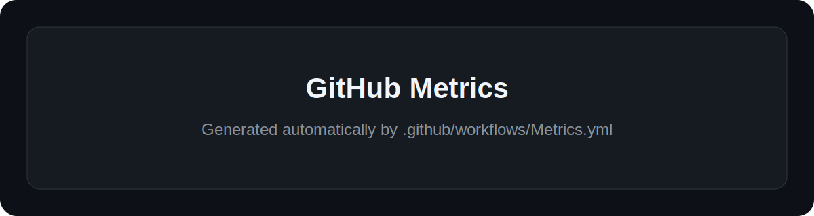
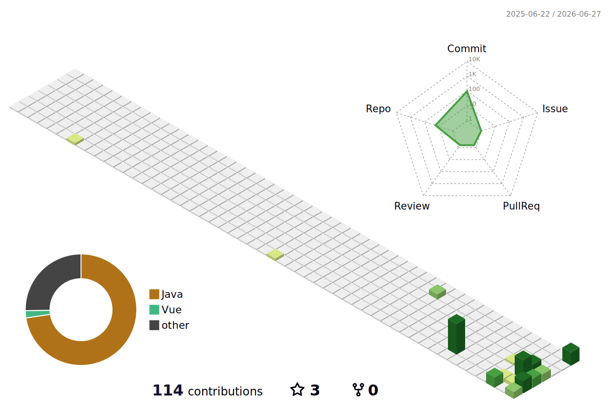

  

# kaduoxzero

**Java 后端 / 全栈开发方向 · Spring Boot · Vue 3 · 微服务 · AI 工程化实践**

---

## 关于我

我主要围绕 **Java Web 后端、前后端分离系统、微服务工程化和 AI 应用集成** 做项目实践。当前主页只展示 `kaduoxzero` 账号下的公开项目和 GitHub 动态数据，不手动填写虚构 Star、Fork、贡献数、奖项、公司、邮箱或社交账号。

我更关注这些方向：

- **后端工程**：Spring Boot、Spring Cloud Alibaba、MyBatis/MyBatis-Plus、接口设计、权限控制、业务分层。
- **中间件应用**：MySQL、Redis、RabbitMQ、Elasticsearch、MinIO、Nacos、Docker Compose。
- **前端协作**：Vue 3、Vite、Element Plus、ECharts、接口联调与后台管理页面。
- **AI 工程化**：大模型 API 接入、AI 报告生成、知识库检索、Agent 流程编排方向实践。

---

## 代表项目

### [SemiRisk](https://github.com/kaduoxzero/SemiRisk)

面向供应链风险管理的 **AI 智能监测平台**。项目围绕公开风险信号、供应商数据、风险事件、预警中心和 AI 报告生成组织功能，目标是把“数据采集 → 风险识别 → 智能分析 → 告警/报告”的流程做成闭环。

**项目解决的问题**

- 将供应链风险事件、企业画像、GIS 地图、知识库问答和报告生成集中到一个业务系统中。
- 通过多级告警、风险详情下钻和处置记录，辅助分析人员跟踪风险事件。
- 引入 DeepSeek API / Spring AI，用于风险摘要、报告撰写和知识库问答等场景。

**涉及技术**：Java 21、Spring Boot 3.5、Spring Cloud、Spring Cloud Alibaba、Vue 3、Vite、Pinia、Three.js、MySQL、Redis、Elasticsearch、MinIO、RabbitMQ、Nacos、Docker、Nginx。

---

### [YunLanHome](https://github.com/kaduoxzero/YunLanHome)

互联网 O2O 家政服务平台方向的 **分布式业务系统实践**。项目围绕下单、优惠券、支付、派单、文件上传和基础服务拆分，重点练习高并发业务、分布式一致性和微服务模块边界设计。

**项目解决的问题**

- 用 Redis + Lua 处理抢券场景中的库存扣减和重复领取问题。
- 用 RabbitMQ 做异步写入，降低高并发请求对数据库的直接压力。
- 用状态机、策略模式和分布式事务思路拆解订单流转、取消、核销、退款等复杂业务。
- 用 Redis Geo / Redisson 处理附近服务人员匹配和多人抢单并发问题。

**相关模块仓库**

| 模块 | 仓库 |
|---|---|
| 基础工程 | [jzo2o-foundations](https://github.com/kaduoxzero/jzo2o-foundations) |
| API 定义 | [jzo2o-api](https://github.com/kaduoxzero/jzo2o-api) |
| 网关服务 | [jzo2o-gateway](https://github.com/kaduoxzero/jzo2o-gateway) |
| 客户服务 | [jzo2o-customer](https://github.com/kaduoxzero/jzo2o-customer) |
| 营销服务 | [jzo2o-market](https://github.com/kaduoxzero/jzo2o-market) |
| 订单服务 | [jzo2o-order](https://github.com/kaduoxzero/jzo2o-order) |
| 交易服务 | [jzo2o-trade](https://github.com/kaduoxzero/jzo2o-trade) |
| 公共服务 | [jzo2o-publics](https://github.com/kaduoxzero/jzo2o-publics) |

---

### [WebAI-Tlias](https://github.com/kaduoxzero/WebAI-Tlias)

基于 Spring Boot + Vue 3 的 **教务管理系统**。项目用于练习前后端分离开发、JWT 登录校验、基础 CRUD、文件上传、操作日志和后台管理页面开发。

**项目解决的问题**

- 用 JWT 和拦截器实现登录认证与接口访问控制。
- 用 MyBatis / MyBatis-Plus 完成部门、员工等业务数据的增删改查和分页筛选。
- 用阿里云 OSS 处理头像和资料上传。
- 用 Spring AOP 自动记录关键操作日志，减少业务代码中的重复记录逻辑。

---

## 技术栈

| 方向 | 技术 |
|---|---|
| 后端 | Java、Spring Boot、Spring Cloud Alibaba、Spring Security、MyBatis / MyBatis-Plus |
| 前端 | Vue 3、Vite、Element Plus、ECharts、Axios、Vue Router |
| 数据与中间件 | MySQL、Redis、Elasticsearch、RabbitMQ、MinIO、Nacos |
| 工程化 | Maven、Docker、Docker Compose、Git、GitHub Actions |
| AI 应用 | DeepSeek API、Spring AI、RAG 知识库、AI 报告生成、Agent 流程设计 |

---

## GitHub 动态看板

  
  

  

---

## Metrics

  

---

## Contribution Snake

<picture>
  <source media="(prefers-color-scheme: dark)" srcset="https://raw.githubusercontent.com/kaduoxzero/kaduoxzero/output/github-contribution-grid-snake-dark.svg" />
  <source media="(prefers-color-scheme: light)" srcset="https://raw.githubusercontent.com/kaduoxzero/kaduoxzero/output/github-contribution-grid-snake.svg" />
  
</picture>

---

## 3D Contribution Graph

  

---

## Trophy

  

---

## Star History

  <picture>
    <source media="(prefers-color-scheme: dark)" srcset="https://api.star-history.com/svg?repos=kaduoxzero/SemiRisk,kaduoxzero/WebAI-Tlias,kaduoxzero/YunLanHome&type=Date&theme=dark" />
    <source media="(prefers-color-scheme: light)" srcset="https://api.star-history.com/svg?repos=kaduoxzero/SemiRisk,kaduoxzero/WebAI-Tlias,kaduoxzero/YunLanHome&type=Date" />
    
  </picture>

> 所有统计图和动态 SVG 均读取 GitHub 公开数据或由 GitHub Actions 自动生成，不在 README 中手动填写 Star、Fork、贡献数或语言占比。

---

## 联系方式

目前只保留 GitHub 公开主页作为联系入口：[@kaduoxzero](https://github.com/kaduoxzero)。

---

  <strong>Keep building. Keep shipping.</strong>

  

