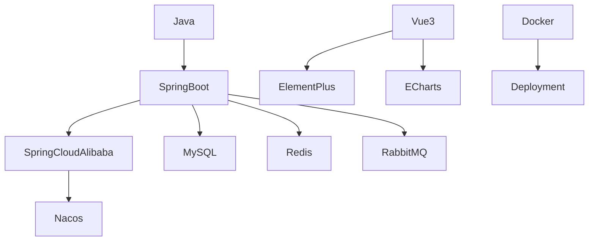

  

  

<h1 align="center">
  
</h1>

---

## About

I am **kaduoxzero**, focusing on Java full-stack development, Spring Boot microservices, Vue 3 frontend engineering, middleware integration, and AI engineering practice.

- Building real projects with **Spring Boot / Spring Cloud Alibaba / Vue 3**.
- Learning and applying **AI Engineering**, including AI-assisted development and project automation.
- Keeping this profile based on **real GitHub public data** and dynamically generated statistics.

---

## Tech Stack

| Category | Stack |
|---|---|
| **Language / IDE** |       |
| **Backend** |     |
| **Frontend** |     |
| **Databases / Middleware** |       |
| **DevOps** |      |

---

## GitHub Activity

  

  
  

  

---

## Trophy

  

---

## Contribution Snake

<picture>
  <source media="(prefers-color-scheme: dark)" srcset="https://raw.githubusercontent.com/kaduoxzero/kaduoxzero/output/github-contribution-grid-snake-dark.svg" />
  <source media="(prefers-color-scheme: light)" srcset="https://raw.githubusercontent.com/kaduoxzero/kaduoxzero/output/github-contribution-grid-snake.svg" />
  
</picture>

---

## 3D Contribution Graph

  

---

## Metrics

  

---

## Technical Roadmap

---

## Star History

  <picture>
    <source media="(prefers-color-scheme: dark)" srcset="https://api.star-history.com/svg?repos=kaduoxzero/kaduoxzero,kaduoxzero/WebAI-Tlias,kaduoxzero/YunLanHome&type=Date&theme=dark" />
    <source media="(prefers-color-scheme: light)" srcset="https://api.star-history.com/svg?repos=kaduoxzero/kaduoxzero,kaduoxzero/WebAI-Tlias,kaduoxzero/YunLanHome&type=Date" />
    
  </picture>

> The chart above reads real public repository data. If a repository is renamed or deleted, remove it from the `repos=` parameter instead of entering manual numbers.

---

## Contact

---

## License

This profile repository is released under the [MIT License](./LICENSE).

  

