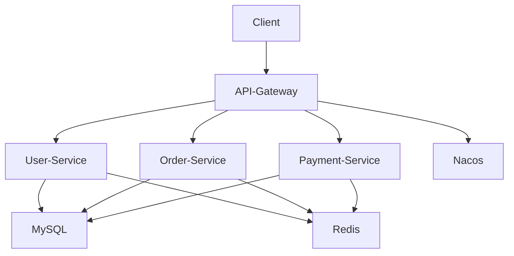

<!--   my-icons -->

    
    
    
    
    
       

<!--   my-header-img -->

<!--   my-ticker -->    

<!--   my-skils -->

| Property             | Data                                                                                                                                                                                                                                                                                                                                                                                                                                                                                                                                                                                                                                                                                                                                                                                                                                                              |
|----------------------|-------------------------------------------------------------------------------------------------------------------------------------------------------------------------------------------------------------------------------------------------------------------------------------------------------------------------------------------------------------------------------------------------------------------------------------------------------------------------------------------------------------------------------------------------------------------------------------------------------------------------------------------------------------------------------------------------------------------------------------------------------------------------------------------------------------------------------------------------------------------|
| **Language / IDE**   |      |
| **Domain Knowledge** |     |
| **CI / CD**          |      |
| **Databases**        |     |
| **Frameworks**       |     |

<!--   GitHub stats graph -->

### 📈 GitHub Activity Graph:

<!--   green snake -->

<!--   stats + languages -->

| .                                                                                                                                                         | .                                                                                                                                       |
|-----------------------------------------------------------------------------------------------------------------------------------------------------------|-----------------------------------------------------------------------------------------------------------------------------------------|
|  |  |

</img>

<!-- dark snake -->

<!--   profile-green-animate -->

<!--   grid-snake  -->

<!--   skyline -->

<!--  TOP codersrank для обновления картинки нужно обновить профиль на странице https://profile.codersrank.io/user/kaduoxzero-->

<!--  2d history skills для обновления картинки нужно обновить профиль на странице https://profile.codersrank.io/user/kaduoxzero-->
</img>

**📫 How to Reach me:**

Trophy: Github Profile Trophy

<!--microservices-->

```mermaid
graph TB
    Client --> API-Gateway;
    API-Gateway --> User-Service;
    API-Gateway --> Order-Service;
    API-Gateway --> Payment-Service;
    User-Service --> MySQL;
    Order-Service --> MySQL;
    Payment-Service --> MySQL;
    User-Service --> Redis;
    Order-Service --> Redis;
    Payment-Service --> Redis;
    API-Gateway --> Nacos;
```

#### Thanks for visiting :heart:

 

## Star History

### Profile Views

 

[MIT](LICENSE)

---
  *If you liked my profile, you can Star ⭐ the repo and if you want to use this template you can Fork it and can use.* 
---
Would you like to meet me?

If you want to contribute to any of my repositories, feel free to submit PRs, issues and email me. Pick a slot if you'd like to meet me and chat about proposals and ideas - but make sure to describe the agenda

---

