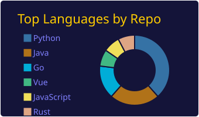
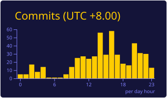

<h1 align="center">
  
</h1>

  <samp>
    A backend engineer passionate about <em>high-concurrency systems</em> and <em>microservices</em>.
      Currently building <strong>SpikeGuard</strong> — a seckill e-commerce platform.
      Java · Spring Boot · Redis · RabbitMQ · PostgreSQL · Docker
  </samp>

  
  

 

  
  
  
  
  
  
  
  
  
  
  
  

<b>🚀 Featured Projects</b>

 

### SpikeGuard — 微服务电商系统
面向商城与秒杀场景的微服务电商系统实践，重点覆盖网关鉴权、库存高并发、异步消息和全链路观测。

| 模块 | 技术栈 | 说明 |
|------|--------|------|
| Gateway | Spring Cloud Gateway | API 网关、限流、鉴权 |
| Seckill | Spring Boot + Redis + Lua | 库存预扣、防超卖 |
| Order | Spring Boot + RabbitMQ | 异步下单、削峰填谷 |
| Risk | LangGraph + Python AI | AI 风控决策引擎 |
| Frontend | Vue 3 + TypeScript | 管理后台 + 商城前端 |

### SemiRisk — AI 风控引擎
面向半导体供应链风险管理的 AI 智能监测平台，集成 RAG 知识库问答、向量检索和 AI 报告自动生成。
**技术栈：** Java 21 · Spring Cloud Alibaba · Elasticsearch · DeepSeek API · LangGraph · Vue 3 · Three.js · Docker

### YunLanHome — O2O 家政平台
分布式业务系统实践，重点练习高并发业务、分布式一致性和微服务边界设计。
**技术栈：** Java 21 · Spring Cloud Alibaba · Redis Geo · RabbitMQ · Seata · Vue 3

### WebAI-Tlias — 教务管理系统
基于 Spring Boot + Vue 3 的前后端分离实践，练习 JWT 登录、CRUD、文件上传和操作日志。
**技术栈：** Spring Boot · Vue 3 · Element Plus · JWT · MyBatis · OSS

<b>🛠️ Tech Stack</b>

 

| 领域 | 核心技术 |
|------|----------|
| **Backend** | Java 21 · Spring Boot 3 · Spring Cloud Alibaba · Spring Security · MyBatis-Plus · JWT / RBAC |
| **Middleware** | PostgreSQL · MySQL · Redis · RabbitMQ · Elasticsearch · MinIO · Nacos · Sentinel · Seata |
| **Frontend** | Vue 3 · Vite · Element Plus · Vant · ECharts · Three.js · Axios |
| **DevOps & AI** | Docker · GitHub Actions · Prometheus · Grafana · Zipkin · Kibana · DeepSeek API · Spring AI · RAG |

<b>📊 GitHub Statistics</b>

 

<table>
  <tr>
    <td></td>
    <td></td>
  </tr>
</table>

<table>
  <tr>
    <td></td>
    <td></td>
  </tr>
</table>

  

<b>🐍 Contribution Animation</b>

 

  

  

